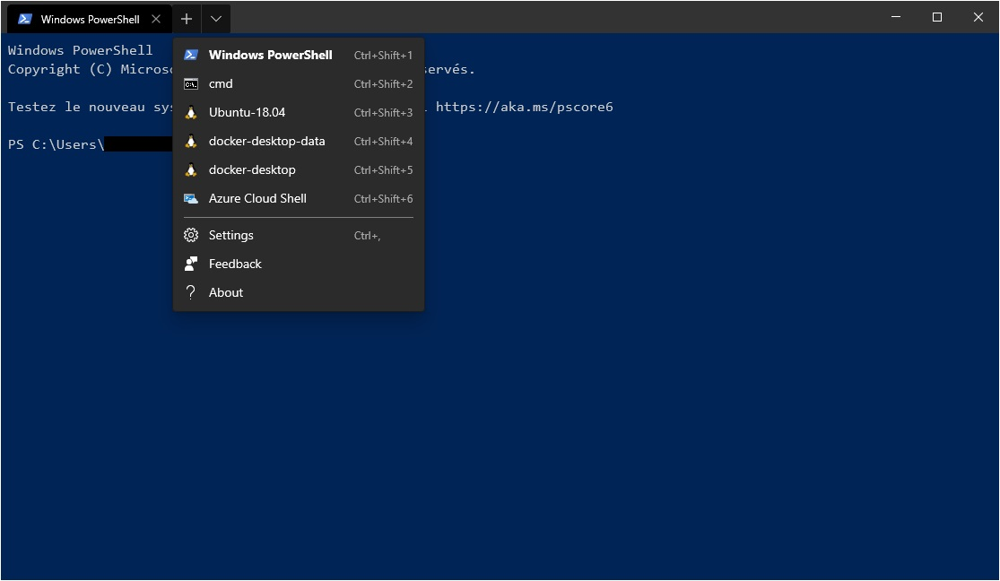
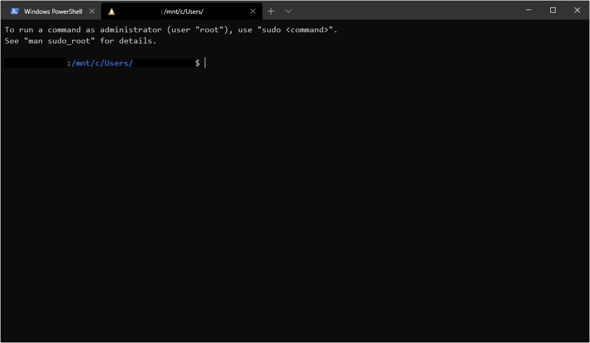

# Create custom Docker image using WSL 2

WSL 2 is (Windows Subsystem for Linux) can now be used with to run Docker natively without requiring an Hyper-V Ubuntu virtual machine. That means than that you can now use Powershell and/or CMD shell on the Windows 10 host to make `docker` commands.

To have WSL 2 installed you will require to have at least Windows 10 Insider Preview build 19018 or higher. For those who don't know yet, it means that as of now 2020/01/03 you will require to at least opt-in the Windows 10 slow ring insiders preview. Also you will require to install Docker Desktop Edge 2.1.6.0 or a later release.

## 1 - Install pre-requisite

https://insider.windows.com/en-us/getting-started/  
https://docs.microsoft.com/en-us/windows/wsl/wsl2-install  
https://docs.docker.com/docker-for-windows/wsl-tech-preview/  

Please follow the instructions in those 3 pages to have the pre-requisite to make this work.

Now for the rest I will assume that we have installed WSL 2 and a Linux distro in it. I also strongly suggest that you get the new Windows Terminal as it will allow you open a powershell, cmd or even a command shell to the linux distro you installed.

https://github.com/microsoft/terminal

## 2 - Build/Publish Orchard Core

We can build Orchard Core inside your Windows 10 Powershell or CMD to make things faster. We could also build it inside your installed linux repo by installing dotnet core latest sdk alternatively. But for making things faster we will build OC inside Windows 10 as we can access the files within the Linux distro later on by using a mounted drive. All the current drives that you have in Windows are available by doing `cd /mnt/your-drive-letter` in your Linux terminal.

So let's open up Windows Terminal on a cmd shell and build/publish OC with these commands : 

``` cmd
cd C:\YourRepositoriesPath
git clone https://github.com/OrchardCMS/OrchardCore.git OrchardCore
dotnet publish src\OrchardCore.Cms.Web\OrchardCore.Cms.Web.csproj -o build\release -c release
```

Now you will be able to find the published version of OC in `C:\YourRepositoriesPath\OrchardCore\build\release`  
or alternatively in your Linux shell in
`/mnt/c/YourRepositoriesPath/OrchardCore/build/release`  

## 3 - Set Dockerfile and .dockerignore

First before creating a new Docker image we will require to change the .dockerignore file and Dockerfile that are provided with the source code of Orchard Core. They won't work as they are set to work with the CI only. You can find these files in `C:\YourRepositoriesPath\OrchardCore\`

## .dockerignore

```
#ignore all files
**

#except release
!/build/release
```

## .dockerfile

```
# This Docker file is intended for WSL 2
# A prerequisite is a published application in the .build/release  

FROM mcr.microsoft.com/dotnet/core/aspnet:3.1

EXPOSE 80
ENV ASPNETCORE_URLS http://+:80

WORKDIR /app
COPY /build/release .

ENTRYPOINT ["dotnet", "OrchardCore.Cms.Web.dll"]
```

## 4 - Create a Docker image of OC

Now that we changed these, let's open up a Linux distro command shell with the Windows Terminal by opening a new tab by finding the distro you previously installed.




Now we can create the Docker images and start it by doing these commands : 

```
cd /mnt/c/YourRepositoriesPath
docker build -t orchard_core .
docker run --name orchardcore -p 80:80 orchard_core
```

Now you can start your favorite browser to http://localhost and start testing your build!

# References

Inspiration taken from Scott Hansellman.

### Developing on Windows with WSL 2 :  

https://www.youtube.com/watch?v=A0eqZujVfYU

### Moving an ASP.NET Core from Azure App Service on Windows to Linux by testing in WSL and Docker first :  

https://www.hanselman.com/blog/MovingAnASPNETCoreFromAzureAppServiceOnWindowsToLinuxByTestingInWSLAndDockerFirst.aspx